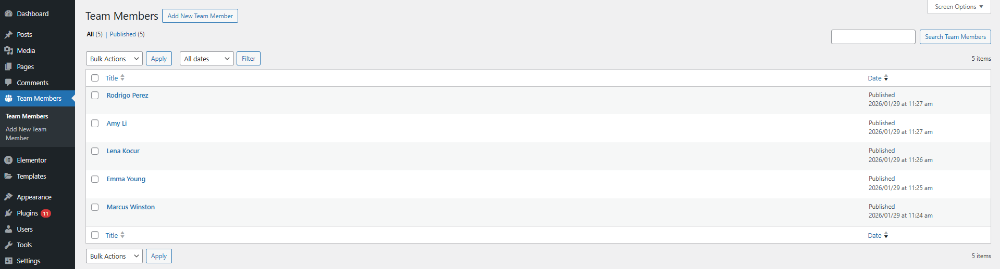
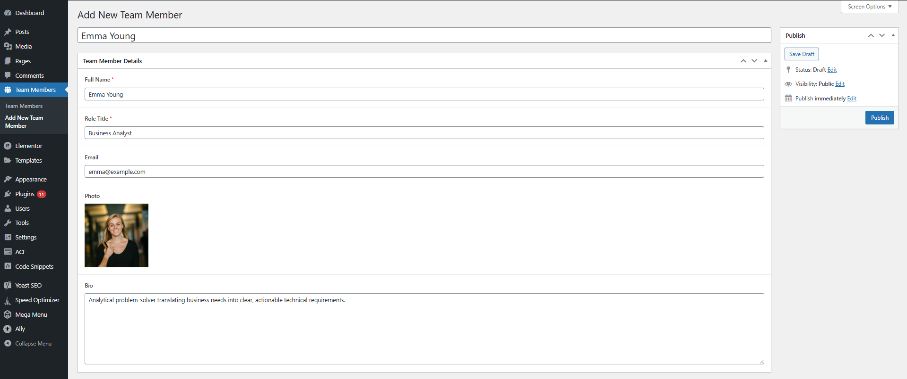
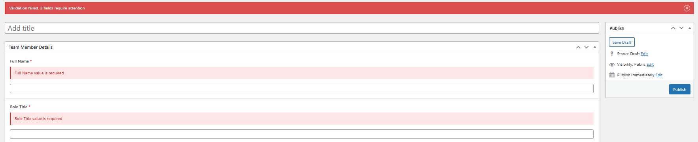
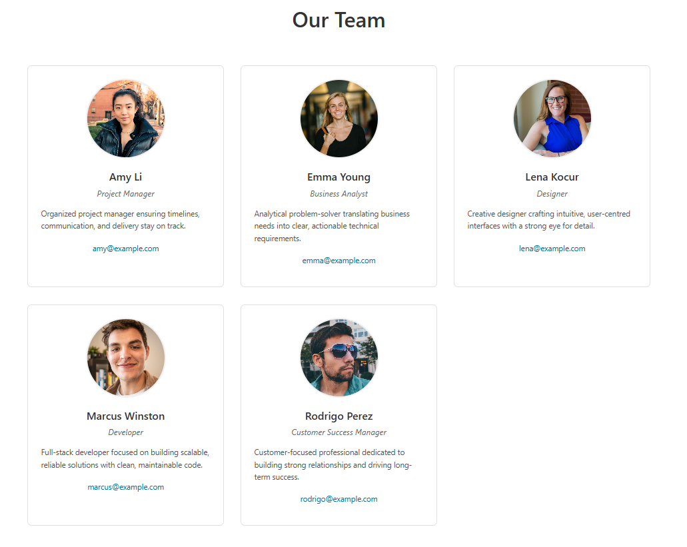
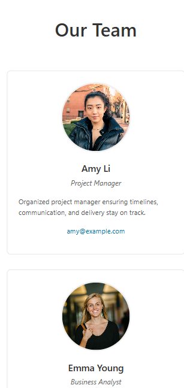

# Team Members Directory

WordPress plugin for managing and displaying team members with Themosis Framework conventions.

## Requirements

- **PHP:** >= 8.1
- **WordPress:** >= 6.0
- **Themosis Framework:** 3.1 (conventions followed)
- **Composer:** >= 2.0
- **ACF Plugin:** Required

## Installation

### Method 1: Drop-in Installation

1. Copy plugin folder to `wp-content/plugins/team-members-directory`
2. Run `composer install` in plugin directory
3. Activate plugin in WordPress admin
4. Install and activate ACF plugin
5. Flush permalinks: **Settings → Permalinks → Save Changes**

### Method 2: Composer Installation

```bash
composer require dominik317/team-members-directory
```

## Usage

### Creating Team Members

1. Go to **Team Members → Add New** in WordPress admin
2. Fill required fields:
   - **Full Name** (required)
   - **Role/Title** (required)
   - **Email** (optional, validated)
   - **Photo** (optional)
   - **Bio** (optional)
3. Click **Publish**

### Displaying Team Members

**Shortcode (embed anywhere):**
```
[team_members]
[team_members limit="6" order="DESC"]
```

**Dedicated Route:**
```
https://yoursite.com/team
```

**In PHP Templates:**
```php
<?php echo do_shortcode('[team_members]'); ?>
```

## Configuration

Edit `config/team.php`:

```php
return [
    'route_slug'    => 'team',          // URL: /team
    'shortcode'     => 'team_members',  // Shortcode name
];
```

**Filter for custom route slug:**
```php
add_filter('team_members_route_slug', function() {
    return 'our-team'; // Changes to /our-team
});
```

## Architecture Notes

This plugin follows Themosis Framework conventions while remaining installable as a standard WordPress plugin. Key decisions:

- **WordPress hooks over ServiceProvider** - Uses `add_action`/`add_filter` instead of Themosis ServiceProvider to maintain standard plugin compatibility
- **WordPress Rewrite API for routes** - Custom `/team` route uses WP Rewrite API since Themosis routing requires Application instance unavailable in standard plugins
- **ACF for fields** - Programmatic field registration with graceful degradation if ACF is missing
- **Controller pattern** - Shared `TeamMemberController` used by both shortcode and route (DRY principle)
- **Static methods** - Simpler API for services/controllers, suitable for plugin scope

## Project Structure

```
src/
├── Admin/              # Field registration & validation
├── Controllers/        # Business logic
├── PostTypes/          # CPT registration
├── Routes/             # Custom route handling
├── Services/           # Validation service
└── Shortcodes/         # Shortcode handler

views/                  # Display templates
assets/css/             # Frontend styles
config/                 # Configuration
tests/                  # PHPUnit tests
```

## Testing

Run unit tests:
```bash
composer test
```

**Coverage:** 7 tests, 16 assertions (TeamMemberValidator service)

## Screenshots

### Admin Interface

**Team Members List:**



**Add/Edit Team Member:**



**Validation Errors:**



### Frontend Display

**Shortcode Output & Route Output (`/team`):**



**Shortcode Output & Route Output (`/team`) on Mobile:**



## Author

**Dominik Sopic** | Version 0.1.0

